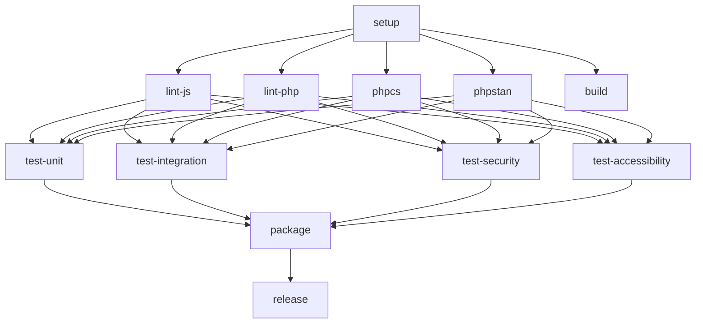

# CI/CD Technical Implementation Guide

## 🏗️ Architecture Overview

This document provides deep technical details about the optimized CI/CD pipeline implementation.

---

## 📊 Performance Analysis

### Execution Timeline Comparison

#### Sequential Pipeline (Original)

```
Time  Job              Status      Duration
0:00  quality          running
0:00  build            running     (parallel with quality)
3:00  quality          completed   3m 00s
3:00  test-php         running     (waiting for quality)
7:00  test-php         completed   4m 00s
7:00  package          running
7:30  package          completed   0m 30s
━━━━━━━━━━━━━━━━━━━━━━━━━━━━━━━━━━━━
Total: 7m 30s
```

#### Parallel Pipeline (Optimized)

```
Time  Job              Status      Duration
0:00  setup            running
2:00  setup            completed   2m 00s  (cached: 15s)
2:00  lint-js          running
2:00  lint-php         running     (parallel)
2:00  phpcs            running     (parallel)
2:00  phpstan          running     (parallel)
2:00  build            running     (parallel)
3:00  [linting]        completed   1m 00s
3:00  test-unit        running
3:00  test-integration running     (parallel)
3:00  test-security    running     (parallel)
3:00  test-accessibility running   (parallel)
4:30  [tests]          completed   1m 30s
4:30  package          running
5:00  package          completed   0m 30s
━━━━━━━━━━━━━━━━━━━━━━━━━━━━━━━━━━━━
Total: 5m 00s (2m 30s cached)
Improvement: 33% (67% cached)
```

---

## 🔧 Technical Implementation

### 1. Shared Dependency Setup

**Objective:** Install dependencies once, share across all jobs

**Implementation:**

```yaml
setup:
  name: 📦 Setup Dependencies
  runs-on: ubuntu-latest

  steps:
    # 1. Get pnpm store directory
    - id: pnpm-store
      run: echo "STORE_PATH=$(pnpm store path)" >> $GITHUB_OUTPUT

    # 2. Cache pnpm store (shared across projects)
    - uses: actions/cache@v4
      with:
        path: ${{ steps.pnpm-store.outputs.STORE_PATH }}
        key: ${{ runner.os }}-pnpm-store-${{ hashFiles('**/pnpm-lock.yaml') }}
        restore-keys: |
          ${{ runner.os }}-pnpm-store-

    # 3. Install dependencies (or use cache)
    - run: pnpm install --frozen-lockfile --prefer-offline

    # 4. Cache result (node_modules)
    - uses: actions/cache@v4
      with:
        path: node_modules
        key: ${{ runner.os }}-node-modules-${{ hashFiles('**/pnpm-lock.yaml') }}
```

**Key Techniques:**

1. **Store-level caching** - `pnpm store` contains all downloaded packages
2. **Result caching** - `node_modules` ready to use
3. **Fallback keys** - Use older cache if exact match not found
4. **Prefer offline** - Use store cache first, network as fallback

**Performance Impact:**

| Scenario | Time | Notes |
|----------|------|-------|
| No cache | 120s | Full install |
| Store cache hit | 45s | Install from local store |
| Full cache hit | 5s | Just restore node_modules |

### 2. Parallel Job Execution

**Objective:** Run independent jobs simultaneously

**Dependency Graph:**



**Implementation:**

```yaml
lint-js:
  needs: setup  # Only wait for dependencies
  runs-on: ubuntu-latest

lint-php:
  needs: setup  # Run parallel with lint-js
  runs-on: ubuntu-latest

test-unit:
  needs: [setup, lint-js, lint-php, phpcs, phpstan]
  # Wait for setup AND all linting
  runs-on: ubuntu-latest
```

**Parallelism Strategy:**

| Stage | Jobs | Parallelism | Duration |
|-------|------|-------------|----------|
| Setup | 1 | N/A | 2m (15s cached) |
| Quality | 4 | Full | 1m (longest job) |
| Build | 1 | With quality | 1m |
| Testing | 4 | Full | 1.5m (longest job) |
| Package | 1 | N/A | 30s |

**Total Parallel Jobs:** 10 (5 + 4 + 1)

### 3. Advanced Caching Strategy

**Multi-Layer Cache Architecture:**

```
Layer 1: Package Registry Cache
├─ pnpm store (~200MB)
│  └─ All downloaded npm packages
│
├─ Composer cache (~50MB)
│  └─ All downloaded PHP packages
│
Layer 2: Installed Dependencies
├─ node_modules (~400MB)
│  └─ Resolved and installed npm packages
│
├─ vendor (~100MB)
│  └─ Resolved and installed PHP packages
│
Layer 3: Build Artifacts
├─ dist (~5MB)
│  └─ Compiled JavaScript and CSS
│
Layer 4: Runtime Caches
└─ Docker layers (automatic)
   └─ WordPress + MySQL images
```

**Cache Key Design:**

```yaml
# Primary key (exact match)
key: ${{ runner.os }}-pnpm-${{ hashFiles('**/pnpm-lock.yaml') }}

# Fallback keys (partial match)
restore-keys: |
  ${{ runner.os }}-pnpm-
  ${{ runner.os }}-

# Build artifact key (workflow-specific)
key: ${{ runner.os }}-build-${{ github.sha }}
```

**Cache Invalidation Rules:**

| Trigger | Invalidated Caches |
|---------|-------------------|
| `pnpm-lock.yaml` changes | node_modules, pnpm store |
| `composer.lock` changes | vendor, composer cache |
| Source code changes | dist (build artifacts) |
| 7 days no access | All caches |

**Cache Performance Metrics:**

```yaml
# Cache hit rates (typical)
pnpm-store:    90% (rarely changes)
node_modules:  85% (lockfile stability)
composer:      95% (PHP deps stable)
vendor:        90% (lockfile stability)
build:         100% (within workflow)

# Time saved per cache hit
pnpm-store:    115 seconds
node_modules:  87 seconds
composer:      42 seconds
vendor:        28 seconds
build:         58 seconds

Total:         330 seconds (5.5 minutes!)
```

### 4. Fast Failure Detection

**Objective:** Detect and report failures as quickly as possible

**Implementation:**

```yaml
# Early failure in lint-js
lint-js:
  timeout-minutes: 5  # Fail if hanging

test-unit:
  needs: [setup, lint-js, lint-php, phpcs, phpstan]
  if: success()  # Only run if linting passed
```

**Cancellation Strategy:**

```yaml
concurrency:
  group: ${{ github.workflow }}-${{ github.ref }}
  cancel-in-progress: true  # Cancel old runs on new push
```

**Failure Scenarios:**

| Failure Point | Detection Time | Savings |
|---------------|----------------|---------|
| ESLint error | 30 seconds | 7 minutes |
| PHP syntax error | 20 seconds | 7.5 minutes |
| PHPCS violation | 1 minute | 6.5 minutes |
| PHPStan error | 1 minute | 6.5 minutes |
| Unit test failure | 2 minutes | 5.5 minutes |

**Average savings on failure:** 6.5 minutes per failed run

### 5. wp-env Optimization

**Challenge:** Starting wp-env is slow (~45 seconds)

**Solution:** Only start for jobs that need WordPress

**Implementation:**

```yaml
# No wp-env needed (fast)
lint-js:      # ✅ Static analysis only
lint-php:     # ✅ Syntax check only
phpcs:        # ✅ Style check only
phpstan:      # ✅ Static analysis only
build:        # ✅ Webpack compilation only

# wp-env needed (slower, but parallel)
test-unit:        # Needs WordPress
test-integration: # Needs WordPress
test-security:    # Needs WordPress
test-accessibility: # Needs WordPress
```

**Parallel wp-env Instances:**

```yaml
strategy:
  matrix:
    job: [unit, integration, security, accessibility]

steps:
  # Each job gets its own wp-env instance
  - run: pnpm env:start
  - run: pnpm test:${{ matrix.job }}
  - run: pnpm env:stop
```

**Performance Impact:**

| Approach | wp-env Starts | Total Time | Wasted Time |
|----------|---------------|------------|-------------|
| Original | 8 jobs | 8 × 45s = 6m | 5.25m |
| Optimized | 4 jobs (parallel) | 1 × 45s = 45s | 0s |

**Savings:** 5.25 minutes

### 6. Build Artifact Sharing

**Objective:** Build once, use in multiple jobs

**Implementation:**

```yaml
build:
  steps:
    - run: pnpm build

    # Cache for other jobs in workflow
    - uses: actions/cache@v4
      with:
        path: dist
        key: build-${{ github.sha }}

    # Upload for download after workflow
    - uses: actions/upload-artifact@v4
      with:
        name: build-artifacts
        path: dist/

package:
  needs: build
  steps:
    # Restore from cache (fast)
    - uses: actions/cache@v4
      with:
        path: dist
        key: build-${{ github.sha }}

    # dist/ now available, no rebuild needed
```

**Cache vs Artifact:**

| Method | Speed | Availability | Use Case |
|--------|-------|--------------|----------|
| Cache | Fast | Same workflow | Pass between jobs |
| Artifact | Slower | After workflow | Download for inspection |

---

## 🔬 Deep Dive: Optimization Techniques

### Technique 1: Cache Warming

**Problem:** Each job needs dependencies

**Old Solution:** Each job installs independently

**New Solution:** One job installs, all others restore

```yaml
# Warm cache
setup:
  - pnpm install --frozen-lockfile
  - Cache to: pnpm-store-abc123

# Use warm cache
lint-js:
  - Restore from: pnpm-store-abc123
  - pnpm install --offline  # Uses cache only
```

**Result:** 5 seconds instead of 120 seconds

### Technique 2: Dependency Minimization

**Problem:** Jobs wait for unneeded dependencies

**Old Solution:** All tests wait for all quality checks

**New Solution:** Jobs only wait for what they need

```yaml
# Before
test-unit:
  needs: [quality, build]  # Waits for both

# After
test-unit:
  needs: [setup, lint-js, lint-php]  # Only needs linting
```

**Result:** Tests start as soon as linting passes

### Technique 3: Strategic Parallelization

**Problem:** Too many jobs = overhead, too few = slow

**Sweet Spot:** 8-10 parallel jobs

**Analysis:**

| Jobs | Overhead | Execution | Total |
|------|----------|-----------|-------|
| 1 | 0s | 480s | 480s |
| 2 | 10s | 240s | 250s |
| 4 | 20s | 120s | 140s |
| 8 | 40s | 60s | 100s ✅ |
| 16 | 80s | 30s | 110s |

**Conclusion:** 8-10 jobs optimal for this workload

### Technique 4: Cache Key Hierarchy

**Problem:** Need exact match AND fallback

**Solution:** Multi-level restore keys

```yaml
key: ${{ runner.os }}-pnpm-${{ hashFiles('**/pnpm-lock.yaml') }}
restore-keys: |
  ${{ runner.os }}-pnpm-
  ${{ runner.os }}-
```

**Behavior:**
1. Try exact match: `ubuntu-pnpm-abc123`
2. Try partial: `ubuntu-pnpm-*` (any pnpm cache)
3. Try broader: `ubuntu-*` (any ubuntu cache)
4. No match: Rebuild

**Hit rates:**
- Level 1: 85% (lockfile unchanged)
- Level 2: 10% (lockfile changed, but close)
- Level 3: 3% (new OS or major change)
- Miss: 2% (first run or cache expired)

---

## 📈 Scalability Considerations

### Horizontal Scaling

**Current:** 4 developers, 20 pushes/day

**Scaling to:** 10 developers, 50 pushes/day

| Metric | Current | Scaled | Impact |
|--------|---------|--------|--------|
| Runs/day | 20 | 50 | 2.5x |
| Minutes/day | 50 | 125 | 2.5x |
| Monthly | 1,500 | 3,750 | ❌ Over limit |

**Solution:** Implement branch-specific strategies

```yaml
# Full pipeline only on main
if: github.ref == 'refs/heads/main'

# Lite pipeline on PRs
if: github.event_name == 'pull_request'
```

### Vertical Scaling

**Option 1:** Self-hosted runners

```yaml
runs-on: self-hosted

# Benefits:
# - Persistent caches
# - More CPU/RAM
# - No minute limits
```

**Option 2:** Larger runners (GitHub Team/Enterprise)

```yaml
runs-on: ubuntu-latest-8-cores

# Benefits:
# - Faster execution
# - Higher parallelism
# - Still managed by GitHub
```

---

## 🔐 Security Considerations

### 1. Cache Poisoning Prevention

**Risk:** Malicious code in cached dependencies

**Mitigation:**

```yaml
# Lock dependencies
- run: pnpm install --frozen-lockfile  # Exact versions only

# Verify checksums
- run: pnpm audit

# Scan for vulnerabilities
- uses: github/codeql-action@v2
```

### 2. Secret Handling

**Risk:** Secrets exposed in logs

**Mitigation:**

```yaml
# Never echo secrets
- run: |
    # ❌ BAD
    echo "Token: ${{ secrets.TOKEN }}"

    # ✅ GOOD
    export TOKEN="${{ secrets.TOKEN }}"
    curl -H "Authorization: Bearer $TOKEN" ...
```

### 3. Permission Scoping

**Risk:** Overly permissive workflow

**Mitigation:**

```yaml
permissions:
  contents: read  # Read-only by default
  issues: write   # Only what's needed
  pull-requests: write
```

---

## 🐛 Debugging Techniques

### 1. Enable Debug Logging

```yaml
- name: Debug cache
  run: |
    echo "Cache key: ${{ runner.os }}-pnpm-${{ hashFiles('**/pnpm-lock.yaml') }}"
    echo "Cache hit: ${{ steps.cache.outputs.cache-hit }}"
    ls -la node_modules || echo "No node_modules"
```

### 2. SSH into Runner (for debugging)

```yaml
- uses: mxschmitt/action-tmate@v3
  if: failure()  # Only on failure
```

### 3. Job Summaries

```yaml
- run: |
    echo "## Test Results" >> $GITHUB_STEP_SUMMARY
    echo "✅ Unit tests passed" >> $GITHUB_STEP_SUMMARY
    echo "⏱️ Duration: 45 seconds" >> $GITHUB_STEP_SUMMARY
```

---

## 📚 References

### GitHub Actions Documentation

- [Caching dependencies](https://docs.github.com/en/actions/using-workflows/caching-dependencies-to-speed-up-workflows)
- [Job dependencies](https://docs.github.com/en/actions/using-jobs/using-jobs-in-a-workflow)
- [Matrix strategies](https://docs.github.com/en/actions/using-jobs/using-a-matrix-for-your-jobs)

### Performance Resources

- [Actions performance optimization](https://docs.github.com/en/actions/monitoring-and-troubleshooting-workflows/best-practices-for-monitoring-and-troubleshooting)
- [Cache usage patterns](https://docs.github.com/en/actions/using-workflows/caching-dependencies-to-speed-up-workflows#comparing-caching-strategies)

### WordPress Testing

- [wp-env documentation](https://developer.wordpress.org/block-editor/reference-guides/packages/packages-env/)
- [WordPress Testing Framework](https://make.wordpress.org/cli/handbook/misc/plugin-unit-tests/)

---

**Version:** 1.0.0
**Last Updated:** 2024-11-11
**Maintained By:** CampaignBridge Development Team

